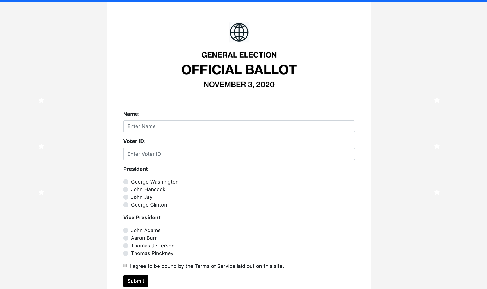
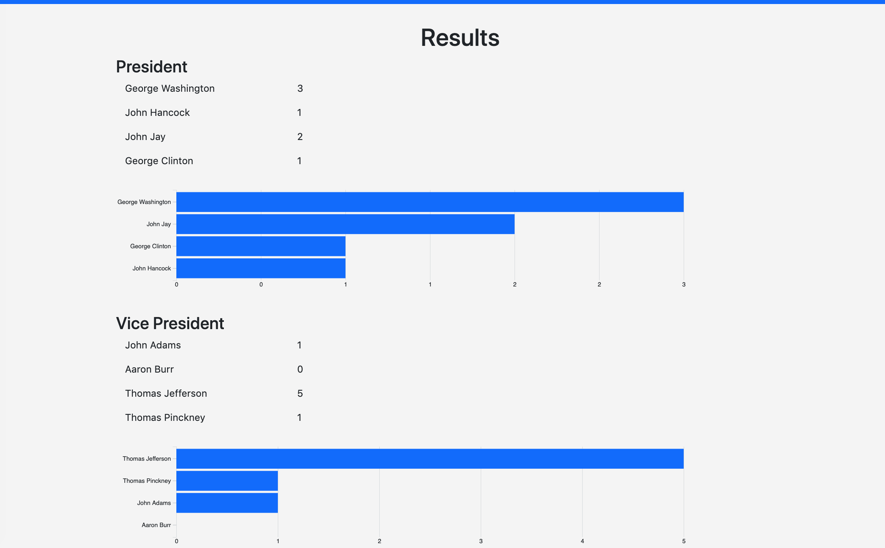

# Real-time Voting System

NYU Big Data Project - Spring 2019

## Demo





<a href="http://www.youtube.com/watch?feature=player_embedded&v=UA1ftS86_PU
" target="_blank"></a>

## Versions
- Kafka: 2.2.0
- Spark/PySpark: 2.4.0
- Python: 3.7

## Kafka
Start ZooKeeper and Kafka (from extracted Kafka folder downloaded from Apache website)
```sh
bin/zookeeper-server-start.sh config/zookeeper.properties
bin/kafka-server-start.sh config/server.properties
```

Create topics
```sh
bin/kafka-topics.sh --create --bootstrap-server localhost:9092 --replication-factor 1 --partitions 1 --topic aggregate-votes
```

Delete
```sh
bin/kafka-topics.sh --zookeeper localhost:2181 --delete --topic aggregate-votes
```

## Python Server
```sh
$ python voting-service/producer.py
```

## MongoDB
```sh
$ mongod --config /usr/local/etc/mongod.conf
$ brew services start mongodb-community@4.0
```

## Reference
- https://kafka.apache.org/quickstart
- http://spark.apache.org/docs/2.4.0/api/python/pyspark.streaming.html

To avoid spark analytics consumer from crashing in Mac OS:
```sh
export OBJC_DISABLE_INITIALIZE_FORK_SAFETY=YES
```
from https://github.com/darkskyapp/forecast-ruby/issues/13
